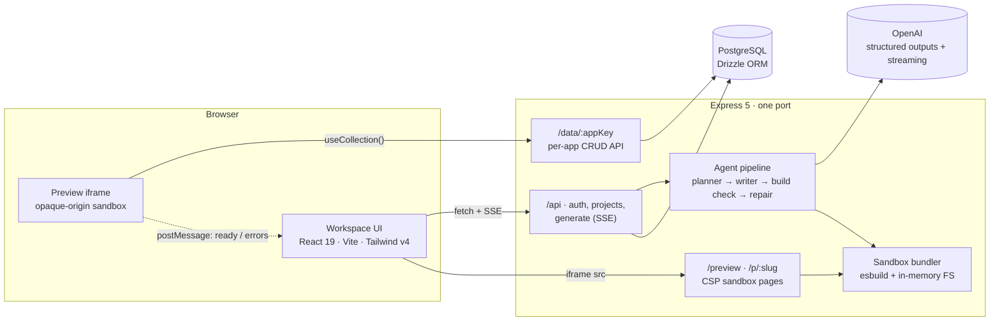
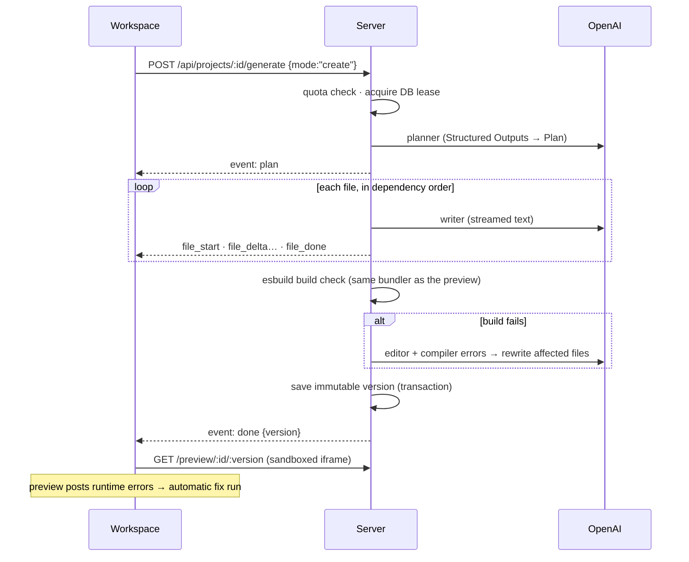

# PromptShip

**Describe an app in plain English. PromptShip plans it, streams the code file by file, runs it in a sandboxed live preview with its own database-backed API, fixes its own runtime errors, and publishes it to a public URL.**

<!-- Replace with your links after deploying: -->
**Live demo:** `https://<your-app>.replit.app` · **Replit project:** `https://replit.com/@<you>/promptship` · **Demo video:** _add link_

```
"A habit tracker with daily check-ins and streaks"
        │
        ▼
  plan (schema + features + files) ──► streamed code ──► build check ──► live preview ──► publish
                                              ▲                               │
                                              └──── auto-fix on runtime error ◄┘
```

## What it does

- **Prompt → plan → code.** A planner agent turns the idea into a structured plan (data collections with fields, features, a file list in dependency order) using OpenAI Structured Outputs. A writer agent then streams each file over Server-Sent Events, so you watch the file tree fill and the code appear live.
- **Real full-stack apps.** Generated React apps persist data through a `useCollection()` hook backed by a per-app CRUD API on PromptShip's Postgres, with separate **preview** and **live** data (like dev/prod databases).
- **Sandboxed live preview.** The server bundles the generated files with esbuild over an in-memory file system. They run in an opaque-origin sandbox (CSP `sandbox` + iframe `sandbox`), so they can't touch PromptShip's cookies or API.
- **Self-healing.**
  - A failed build check triggers a repair pass that uses the compiler's `file:line` errors.
  - Runtime errors from the preview (`window.onerror`, unhandled rejections, React error boundaries) go back to a fixer agent automatically, at most 2 attempts in a row.
- **Iterate with versions.** "Add a dark mode toggle" produces v2. Every generation is an immutable version you can view, branch from, or restore.
- **Ship it.**
  - **One-click publish** to `/p/<slug>`.
  - **Export** a runnable Vite + React + Tailwind project as a ZIP, or **push it to a new GitHub repo** in one commit (OAuth).
- **Accounts and limits.** Username/password or one-click guest accounts, per-user daily run quotas, and per-IP rate limits (the OpenAI key is protected on a public deployment).

## Architecture



### One generation run



## Design decisions and trade-offs

| Decision | Why |
|---|---|
| **One server port.** Vite runs as Express middleware in dev; production serves the static build. | Replit Autoscale exposes exactly one port. Dev and prod share one origin, so cookies, CSP and the iframe behave identically. |
| **Server-side esbuild bundling over a virtual file system** instead of Babel in the browser | Generated files are real ES modules: the ZIP export runs them unchanged. Build errors come back with `file:line`, which the fixer needs. The plugin resolves imports only from memory, so user code never touches the disk or runs on the server. |
| **Opaque-origin sandbox**: iframe without `allow-same-origin`, plus a `Content-Security-Policy: sandbox` response header | With `allow-same-origin` on our own origin, generated code could call PromptShip's API with the user's session. The CSP header also sandboxes published pages opened directly. `allow-forms` stays on, otherwise React `onSubmit` never fires. |
| **Runtime assets** (React dev/prod, Tailwind, error bridge) bundled once at boot and served with content hashes, CORS and `CORP: cross-origin` | No CDN dependency. Opaque-origin pages can load them. `crossorigin="anonymous"` keeps error messages from being masked as `Script error.` |
| **Per-app data API with capability keys** instead of cookies | Sandboxed pages can't send cookies, and shouldn't. An unguessable key selects one app's preview or live data. The API is CORS-open, size- and count-limited, and rate-limited. |
| **Structured Outputs for plans; streamed plain text for code** | Plans need a guaranteed shape. Code needs to stream token by token, which partial JSON would make awkward. The editor rewrites whole files: this is more reliable than diffs, and the files are small. |
| **SSE over `fetch`** (POST), `Cache-Control: no-transform`, 15 s heartbeats, abort on disconnect | `EventSource` can't POST. `no-transform` stops compression from buffering the stream. Closing the tab aborts the model calls, which saves tokens. |
| **Atomic DB lease**: one run per project | Correct across multiple Autoscale instances, unlike an in-memory lock. The lease expires, so a crashed instance can't block a project. |
| **Immutable versions** with `unique(project_id, version)` | Iterate, fix and restore always append. History is never rewritten. |
| **Mock LLM provider** | The whole product, and every test, runs deterministically without an API key. `[broken]` and `[syntax]` prompts exercise the failure paths. |

**Known limitations / next steps:**
- Generated apps share PromptShip's domain. Production would serve them from a separate origin, such as `*.promptship-apps.dev`, which would also give them real storage.
- App data is schemaless JSONB. Next step: per-app Postgres schemas with generated migrations.
- Other items: WebContainers for Node back-ends in generated apps, collaborative editing over WebSockets, custom domains for published apps.

## Tech stack

| Layer | Tools |
|---|---|
| Client | React 19, Vite 8, Tailwind CSS v4, TanStack Query, zustand, wouter, CodeMirror 6, react-resizable-panels |
| Server | Node 22+, Express 5, TypeScript, zod, Drizzle ORM, PostgreSQL 16, esbuild, fflate |
| AI | OpenAI Chat Completions: Structured Outputs (`zodResponseFormat`) and streaming |
| Security | scrypt passwords, sha256-hashed session tokens, SameSite cookies + Origin check (CSRF), helmet, express-rate-limit, AES-256-GCM for OAuth tokens |
| Testing | Vitest + supertest (59 tests), Playwright (10 E2E tests against the production build), GitHub Actions |

## Run it locally

Requirements: **Node 22+** and **Docker** (for Postgres).

```bash
git clone <this repo> && cd promptship
docker compose up -d                 # Postgres 16 on :5432 (creates promptship + promptship_test)
cp .env.example .env                 # then set SESSION_SECRET (and OPENAI_API_KEY for real generations)
npm install
npm run dev                          # http://localhost:3000
```

- Without `OPENAI_API_KEY`, development runs on the **mock LLM**: the header shows a "Mock LLM" badge, and every prompt produces a small task board app.
- Generate a session secret: `node -e "console.log(require('crypto').randomBytes(32).toString('base64url'))"`

| Command | What it does |
|---|---|
| `npm run dev` | Dev server with HMR (API + client + previews on one port) |
| `npm run build` / `npm start` | Production build (`dist/`) and server |
| `npm run typecheck` | TypeScript for client, server and E2E |
| `npm test` | Vitest: unit + API integration tests against `promptship_test` |
| `npm run test:e2e` | Builds, then runs Playwright against the production server with the mock LLM |
| `npm run db:generate` | New SQL migration after editing `server/src/db/schema.ts` (migrations run on boot) |

## Deploy on Replit

1. Push this repository to GitHub, then in Replit choose **Create Repl → Import from GitHub**. The `.replit` file selects Node 22 and PostgreSQL 16.
2. Open **Database** and create a PostgreSQL database. Replit injects `DATABASE_URL`.
3. Open **Secrets** and add:
   - `SESSION_SECRET` (32+ random characters)
   - `OPENAI_API_KEY`
   - optionally `OPENAI_MODEL`
4. Press **Run**. Migrations apply automatically and the webview shows the app.
5. Choose **Deploy → Autoscale**. Build and run commands come from `.replit` (`npm run build`, `npm run start`).
   - Add the same secrets to the deployment.
   - Check `https://<your-app>.replit.app/api/health`.
6. *(Optional) Push to GitHub.*
   1. Create a GitHub OAuth App with callback URL `https://<your-app>.replit.app/api/github/callback`.
   2. Set `GITHUB_CLIENT_ID`, `GITHUB_CLIENT_SECRET` and `APP_URL=https://<your-app>.replit.app`.
   3. Use a second OAuth App for local development, with callback `http://localhost:3000/api/github/callback`.

If Autoscale ever cuts long streaming runs, a Reserved VM deployment works with the same configuration.

## Configuration

| Variable | Default | Purpose |
|---|---|---|
| `DATABASE_URL` | required | Postgres connection string |
| `SESSION_SECRET` | required | 32+ chars. Derives the key that encrypts stored GitHub tokens |
| `OPENAI_API_KEY` | required in production | Enables the OpenAI provider |
| `LLM_PROVIDER` | `openai` if a key is set, else `mock` (development only) | Force `openai` or `mock` |
| `OPENAI_MODEL` | `gpt-5.4-mini` | Model for all agents |
| `OPENAI_REASONING_EFFORT` | unset | `none`/`minimal`/`low`/`medium`/`high` for reasoning models |
| `OPENAI_BASE_URL` | unset | Any OpenAI-compatible endpoint |
| `DAILY_RUN_LIMIT` / `GUEST_DAILY_RUN_LIMIT` | `40` / `10` | Generation runs per user per 24 h |
| `AUTH_ATTEMPTS_PER_15MIN` / `GUEST_SIGNUPS_PER_HOUR` | `30` / `5` | Per-IP limits |
| `APP_URL` | request origin | Public base URL (GitHub OAuth callback) |
| `GITHUB_CLIENT_ID` / `GITHUB_CLIENT_SECRET` | unset | Enable "Push to GitHub" |
| `PORT` | `3000` | HTTP port |

## Project layout

```
client/            React workspace (pages: Login, Dashboard, Workspace; components/workspace/*)
server/src/
  agent/           prompts, planner, writer (streaming), editor, pipeline (+ build check/repair)
  llm/             LlmClient interface, OpenAI + mock providers
  sandbox/         esbuild virtual-FS bundler, HTML shell, runtime assets
  routes/          auth, projects, generate (SSE), preview, data, ship (publish/export), github
  services/        project/version/app-data queries
  auth/ db/ export/ lib/
server/runtime/    browser code bundled into generated apps: error bridge, React mount, promptship SDK
server/drizzle/    SQL migrations (applied on boot)
shared/            zod schemas + types shared by client and server (plan, events, API DTOs)
e2e/               Playwright tests
```

## Prompts that work well

- *A habit tracker with daily check-ins and streaks*
- *An expense splitter for roommates that shows who owes whom*
- *A kanban board with To do, Doing and Done columns*

Follow-ups: *"add a due date to each card and sort by it"*, *"add a dark mode toggle"*, *"show a weekly chart of completed habits"*.

## License

MIT
